# 📊 Claim Cost Analysis for a Digital Insurance Company

This project presents a data-driven analysis of claim costs using SQL and Power BI, based on a publicly available insurance dataset. The goal is to extract actionable insights that can inform pricing, risk assessment, and customer segmentation for a digital insurance company.

---

## 📁 Dataset

- Source: [Kaggle - Medical Cost Personal Dataset](https://www.kaggle.com/datasets/mirichoi0218/insurance)
- Records: 1,338
- Fields:  
  `age`, `sex`, `bmi`, `children`, `smoker`, `region`, `charges`

---

## 🧰 Tools Used

- **SQL (MySQL 8.0)**: Data wrangling, aggregation, filtering
- **Power BI**: Interactive dashboard and visualization

---

## 🧠 Key Insights

### 1. 🔥 Claim Cost by Smoking Status
- **Smokers** have an average claim cost of **~$32050.23**
- **Non-smokers** average just **~$8434.30**
> Smoking is a strong indicator of high medical cost risk.

---

### 2. 📈 Age and BMI vs. Claim Cost
- **Claim cost increases significantly with age**.
- **Higher BMI correlates with larger claims**, especially above 30.
> Older and overweight individuals tend to incur higher medical costs.

---

### 3. 🗺️ Region-wise Insights
- The **Southeast** region has the **highest average claim cost**.
- **Northeast** and **Northwest** have similar, lower averages.
> This may reflect regional lifestyle or healthcare pricing differences.

---

### 4. 🧍 Age Group Distribution
Custom `age_group` column created:
- `<18` ➝ Minor  
- `18–35` ➝ Young Adult  
- `36–60` ➝ Adult  
- `60+` ➝ Senior Citizen  

- **Adults (36–60)** file the **most claims** in number and value.
> Target group for policy adjustments or incentives.

---

### 5. ⚡ Top 5 High Claim Records
- Highest individual claims all come from **smokers** with **high BMI (35+)**
> Supports underwriting restrictions or adjusted premiums.

---

### Tables

**1)** Male and Female customers count

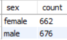

**2)** Average charges by Sex

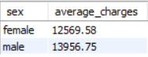

**3)** Region-wise customer distribution

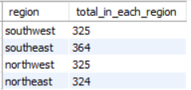

**4)** Region-wise average age and BMI

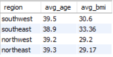

**5)** Average charges per region

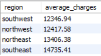

**6)** Smoker count

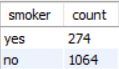

**7)** Average age and BMI for smokers and non-smokers

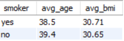

**8)** Average charges for smokers and non-smokers


**9)** Count of person per age group

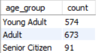

**10)** Average BMI per age group

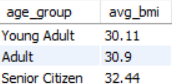

**11)** Average charges per age group

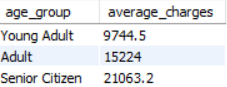

**12)** Count of people in each BMI category

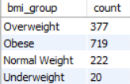

**13)** Average charges per BMI category

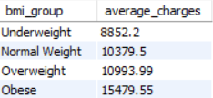

**14)** Summary

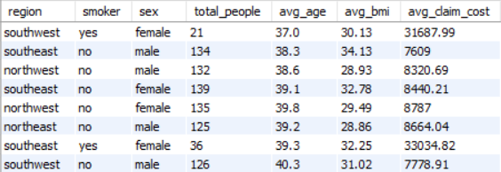

---

## 🧾 SQL Queries Summary

Key SQL operations included:
- `GROUP BY` for smoker, region, sex
- `CASE` to derive `age_group`
- `ROW_NUMBER()` to calculate **median**
- `ORDER BY` + `LIMIT` for top claimants
- `JOIN` and `VIEW` creation for Power BI

```sql
-- Sample: Avg claim by region
SELECT region, ROUND(AVG(claim_cost), 2) AS avg_claim_cost
FROM insurance
GROUP BY region;


